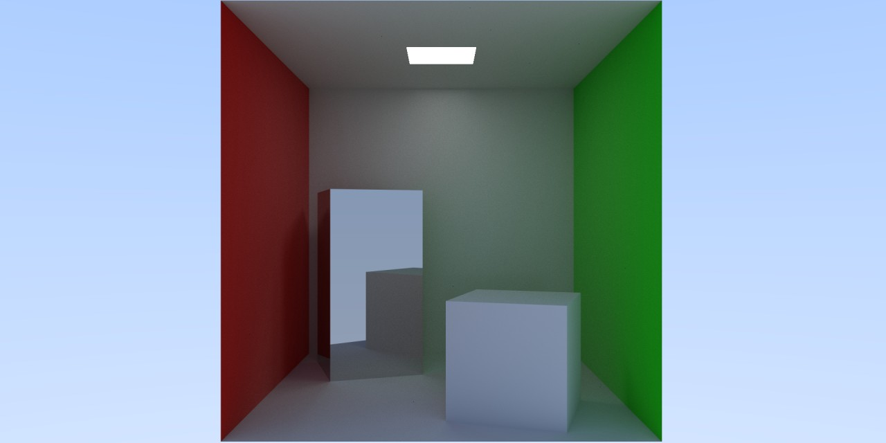
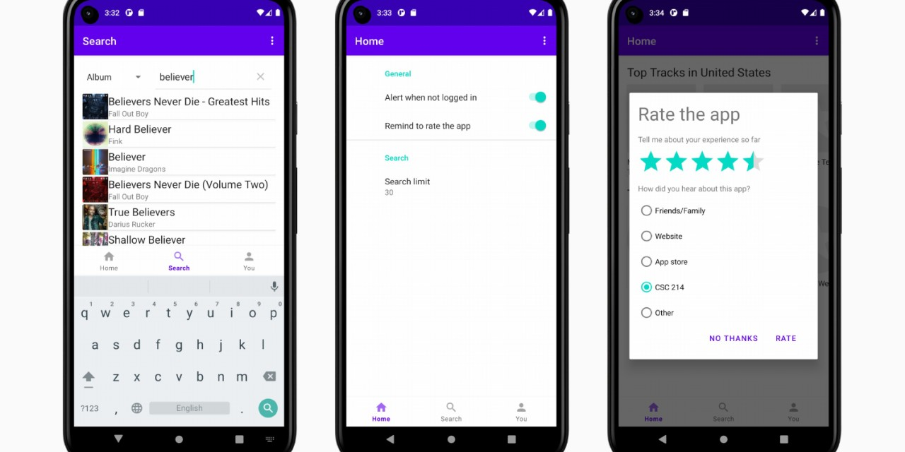

# Hi, I'm Zach :wave:

Multidisciplinary builder, pixel-perfectionista. The Web is an amazing platform.
Always learning. 🤟🏻

<table>
  <tbody>
    <tr>
      <td>
        
      </td>
      <td>
        
      </td>
    </tr>
    <tr>
      <td>WebGPU rendering engine</td>
      <td>CUDA ray tracing</td>
    </tr>
    <tr>
      <td>
        
      </td>
      <td>
        
      </td>
    </tr>
    <tr>
      <td>3D synthwave aesthetics driving simulator</td>
      <td>C++ software graphics library for the terminal</td>
    </tr>
    <tr>
      <td>
        
      </td>
      <td>
        
      </td>
    </tr>
    <tr>
      <td>Last.fm Android music app</td>
      <td>Interactive map viewer and pathfinder</td>
    </tr>
  </tbody>
</table>

## 🌈 Skills

### Programming languages

### Graphics

### Mobile app dev

Mobile:

### Web dev

### Software

## ✨ Other things

- Favorite programming language: Rust. :crab:
- Favorite technology: WebGPU.
- Interests: breakdancing :man_dancing:, skateboarding :skateboard:.

---

