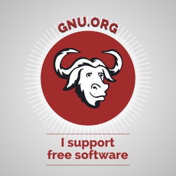
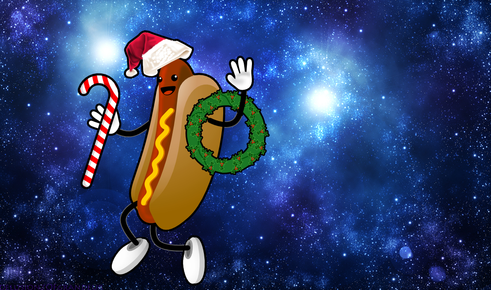

# Hi there :wave:

:sunglasses: I'm **Duong** (not Nguyen), a high school senior.  
:desktop_computer: I'm aspiring to a career in **Graphics and HCI research**.  
:triangular_ruler: I love **digital media design**.  
:night_with_stars: I want to create **mesmerizing 3D digital art and immersive
experience**.  
:man_technologist: I'm currently working with **[three.js][1] and Jekyll**.  
:briefcase: I use [Atom][2] :atom: & [Firefox][3] on [Fedora GNU/Linux][4].  
:gift_heart: I'm a [**free software & public domain evangelist**][5].  
:shipit: Other things I do: breakdancing, contemplating :thinking:, and
reselling Toblerone.

[1]: https://you-create.github.io/three.js-sketches
[2]: https://atom.io
[3]: https://www.mozilla.org/en-US/firefox/new
[4]: https://getfedora.org
[5]: https://github.com/you-create/reveal-init/wiki/Supporting-the-Public-Domain

	
I'm Feeling Lucky (click)

	<b><i>Meet Beefy Miracle!</i></b> :rainbow:
	

[github]: https://github.com/you-create
[dribbble]: https://dribbble.com/you_create
[unsplash]: https://unsplash.com/@you_create
[medium]: https://medium.com/@you_create
[openprocessing]: https://www.openprocessing.org/user/206009
[instagram]: https://www.instagram.com/you_create.designs
