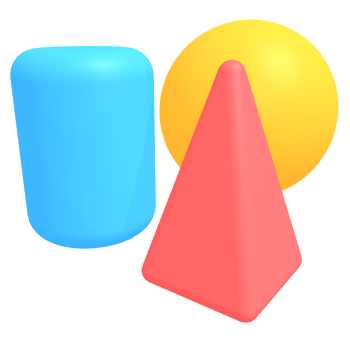

Hi, I'm Novak :wave:
====================

Free software engineer, digital media designer, and aspiring computer graphics 
scientist.

Life
----

:shipit: [**Free Software Foundation**][fsf] Student Associate Member  
:shipit: [**University of Rochester**][csur] Computer Science '25  
:shipit: [**42tm**][42tm] founder & free software engineer

[fsf]:  https://member.fsf.org
[csur]: https://www.cs.rochester.edu
[42tm]: https://github.com/42tm

Dev
---

:coffee:     **Java** ([AoC 2020][aoc2020], [AoC 2021][aoc2021])  
:sunglasses: **JavaScript** ([lnagb.js][lnagbjs], [three.js sketches][three], [Flat Candies][flat])  
:ox:         **Bash** ([reveal-init][ri], [gnu][gnu], [battery][battery])  
:memo:       **Vim**, GNU nano  
:heart:      **3D**, **new tech**, and **GNU/Linux**

[aoc2020]: https://github.com/novakcgx/advent-of-code-2020
[aoc2021]: https://github.com/novakcgx/advent-of-code-2021
[lnagbjs]: https://github.com/novakcgx/lnagb.js
[three]:   https://github.com/novakcgx/three.js-sketches
[flat]:    https://github.com/novakcgx/flat-candies
[ri]:      https://github.com/novakcgx/reveal-init
[gnu]:     https://github.com/novakcgx/gnu
[battery]: https://github.com/novakcgx/battery

- - -

