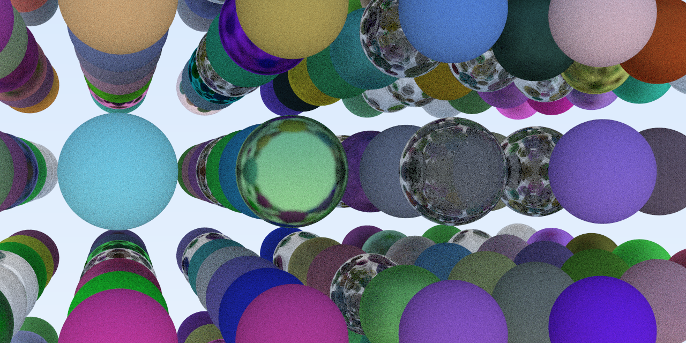
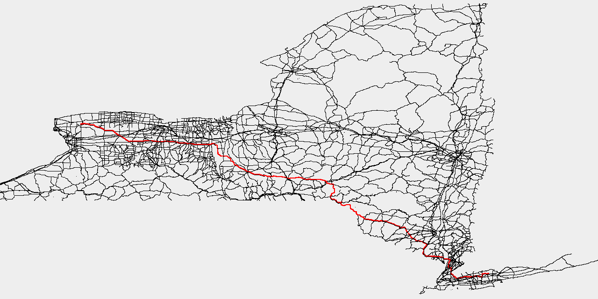
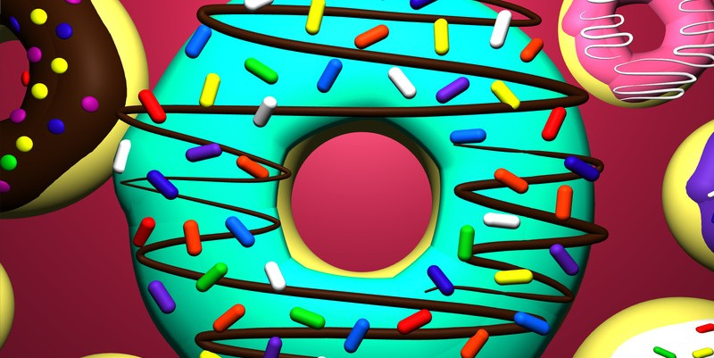

# Hi, I'm Zach :wave:

Graphics. Games. Creative coding. Endeavoring to help bring fun and beauty into
software. Obsessed with performance and clean code craftsmanship.

<table>
  <tbody>
    <tr>
      <td>
        
      </td>
      <td>
        
      </td>
    </tr>
    <tr>
      <td>CUDA ray tracing</td>
      <td>3D synthwave aesthetics driving simulator</td>
    </tr>
    <tr>
      <td>
        
      </td>
      <td>
        
      </td>
    </tr>
    <tr>
      <td>Last.fm Android music app</td>
      <td>Interactive map viewer and pathfinder</td>
    </tr>
    <tr>
      <td>
        
      </td>
      <td>
        
      </td>
    </tr>
    <tr>
      <td>WebGL experiments</td>
      <td>Design portfolio</td>
    </tr>
  </tbody>
</table>

## Life

:shipit: CS + REU Fellow @ [**University of Rochester**][ur]  
:shipit: Vice President @ [**Computer Science Undergraduate Council**][csug]  
:shipit: Student Member @ [**ACM SIGGRAPH**][siggraph]  
:shipit: ex-Android @ [**Taperk**][taperk]  
:shipit: Full-stack @ [**RocLab**][roclab]  
:shipit: Founder @ [**42tm**][42tm] (2020 regional top 5 GitHub org.)  

[ur]: https://rochester.edu
[csug]: https://ur-csug.org
[siggraph]: https://siggraph.org
[taperk]: https://taperk.com
[roclab]: https://roclab.io
[42tm]: https://github.com/42tm

## Skills

Programming languages:

Graphics:

Mobile:

Web:

Software:

_Favorite programming language: Rust :crab:._  
_Fun tidbits: My side interests are :paintbrush: graphics design, :man_dancing:
breakdancing, and :skateboard: skateboarding._

  <b>Looking for a software engineering intern?
    <a href="https://www.linkedin.com/in/zach-nguyen">Let's connect and talk!</a>
  </b>

---

<!---->

